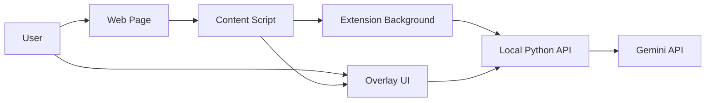

# Browser Translation Extension Plan

## 目的

本企画書は、既存の Gem Read のバックエンド資産を一部流用しつつ、
Chrome / Edge 上で閲覧中の HTML 本文を Gemini API に送信して翻訳や補助解析を行う
ブラウザ拡張プロジェクトのたたき台を示す。

## 背景

現行アプリは PDF / EPUB を対象とするローカルデスクトップアプリであり、
選択領域のテキスト抽出、画像付きマルチモーダル送信、Gemini モデル切替、
Context Cache などの機能を備えている。

一方で、日常的な情報収集ではブラウザ上の記事、論文要約ページ、技術文書、ブログなど、
HTML コンテンツに対して同様の翻訳・解析体験を求める場面が多い。
そこで、ブラウザで選択した本文やその周辺画像を対象に、既存の AI 連携資産を再利用しながら
軽量な拡張機能として提供する。

## プロダクト概要

ユーザーがブラウザ上で本文を選択すると、拡張機能が選択テキストを抽出し、
必要に応じて選択範囲のスナップショット画像も取得してローカル Python バックエンドへ送信する。
バックエンドは Gemini API を呼び出し、翻訳、解説付き翻訳、カスタムプロンプト解析を実行する。
結果はブラウザ上のオーバーレイ UI に表示する。

## 目標

- HTML ページ上の本文テキストを選択して Gemini に送れること
- 選択範囲に対応するスナップショット画像を補助入力として送れること
- 翻訳、解説付き翻訳、カスタムプロンプト解析を提供すること
- 既存 Python 資産のうち Gemini 連携と設定管理を再利用すること
- Chrome / Edge の両方で動作すること
- UI は最終的にブラウザページ上のオーバーレイで表示すること

## 非目標

- PDF ビューアや EPUB リーダー機能をブラウザ拡張内に再実装すること
- ページ全体の完全な OCR を常時行うこと
- サーバー常設の SaaS を最初から構築すること
- すべてのサイトで同一の DOM 抽出精度を保証すること

## 想定ユースケース

- 技術記事の一部段落を選択して日本語に翻訳する
- 数式や図表を含む箇所を選択し、テキストに加えて画像も送って補助解析する
- 英文論文紹介ページの複数箇所を順に選択し、まとめて翻訳する
- 用語の背景説明を含めた解説付き翻訳をその場で確認する
- 選択箇所について自由入力のカスタムプロンプトで問い合わせる

## 必須要件

- 選択テキストの抽出
- 複数選択の保持と順序付き送信
- 選択範囲のスナップショット取得
- Gemini へのテキスト + 画像のマルチモーダル送信
- モデル切替
- 結果表示 UI
- ローカル設定保存
- API キーを拡張内に持たず、Python 側に閉じ込める構成

## 推奨要件

- 記事本文全体抽出による Context Cache 利用
- サイトごとの抽出失敗時フォールバック
- レート制限や API エラー時の分かりやすい表示
- ショートカットからの起動
- オーバーレイ位置、サイズ、テーマの調整

## 技術方針

### 採用方針

- フロントエンド: TypeScript ベースの Chrome / Edge 拡張
- バックエンド: ローカル Python サービス
- AI 呼び出し: Gemini API
- UI 表示: Content Script から注入するオーバーレイ

### この構成を採る理由

- DOM 選択、オーバーレイ描画、拡張権限、スクリーンショット取得は TypeScript 側が自然
- 既存の Gemini 連携、DTO、設定、キャッシュ制御は Python 側資産を流用しやすい
- API キーをブラウザ拡張に置かずに済む
- ローカルアプリとして段階的に開発しやすい

### リポジトリ構成方針

既存資産の直接インポートや機能検証を迅速に行うため、初期開発段階では同一リポジトリ（モノレポ構成）での開発を採用する。
- **構成案**: 現状の `gem-read` リポジトリ直下にブラウザ拡張用のディレクトリ（例: `extension/` または `browser-extension/`）を新設してフロントエンド実装を行う。
- **メリット**: 既存のPythonモジュール（`ai_model.py` 等）をそのまま参照でき、ローカルAPIと拡張機能の連携テストが単一ワークスペースで完結する。
- **将来的な見直し**: 共通利用するバックエンドAPIがデスクトップアプリ（Gem Read）から完全に分離・独立した段階で、必要に応じてリポジトリの分離を検討する。

## システム構成案

## コンポーネント責務

### 1. Content Script

- ユーザーのテキスト選択を取得する
- 選択範囲の矩形座標を取得する
- 必要に応じて本文抽出候補を判定する
- オーバーレイ UI をページ上に注入する
- 結果表示や複数選択状態の反映を行う

### 2. Background Service Worker

- `chrome.tabs.captureVisibleTab` など権限が必要な処理を担当する
- Content Script とローカル API の橋渡しを行う
- タブ情報、サイト単位設定、権限状態を管理する

### 3. Overlay UI

- 選択プレビューの表示
- 複数選択の一覧表示と削除
- モデル選択
- 翻訳、解説付き翻訳、カスタムプロンプト送信
- ローディング、エラー、結果表示

### 4. Local Python API

- Gemini API 呼び出し
- モデル一覧取得
- Context Cache 管理
- 設定管理
- トークン計測
- 画像前処理の最終調整

## 既存資産の再利用方針

### 再利用しやすい資産

- `src/pdf_epub_reader/models/ai_model.py`
- `src/pdf_epub_reader/dto/ai_dto.py`
- `src/pdf_epub_reader/utils/config.py` の AI 設定部分
- `src/pdf_epub_reader/interfaces/model_interfaces.py` の AI 側契約の考え方

### 参考実装として流用する資産

- `src/pdf_epub_reader/presenters/panel_presenter.py` の複数選択連結ロジック
- `src/pdf_epub_reader/presenters/main_presenter.py` の選択スロット管理の考え方

### 流用せず置き換える資産

- `src/pdf_epub_reader/models/document_model.py`
- PySide6 ベースの View 層
- qasync を前提にしたアプリ起動構成

## UI 方針

### 最終形

ページ右側または選択近傍に固定表示されるオーバーレイ UI を採用する。
Content Script から Shadow DOM を使って注入し、ページ本体の CSS と衝突しにくい構成にする。

### 初期実装

MVP の段階では、オーバーレイ UI を最初から採用してよい。
ただし実装難度が想定より高い場合は、暫定的に拡張のサイドパネル表示へ退避できるよう設計する。

### UI 要件

- ページ選択を邪魔しないこと
- 最小化と再表示ができること
- 選択プレビューと結果表示を見比べやすいこと
- モバイル表示は対象外とし、デスクトップブラウザを優先すること

## テキスト抽出方針

### 優先順位

1. ユーザーの明示的なテキスト選択をそのまま取得する
2. 必要に応じて親要素をたどって文脈候補を抽出する
3. 記事全文が必要な場合のみ main content 抽出を行う

### 実装方針

- 基本は Selection API と Range API を使用する
- 複数選択はネイティブ選択に依存せず、内部リストとして保持する
- 本文全体抽出は Readability 系ライブラリの利用を検討する

## 画像取得と前処理方針

### 基本方針

画像入力は常時送るのではなく、数式、図表、崩れた文字、レイアウト依存の箇所など、
テキストだけでは不十分な場面で補助的に使う。

### トークン節約の優先順位

1. 不要領域を送らない
2. 選択範囲だけを tight crop する
3. 目的に応じて長辺をリサイズする
4. 最後に圧縮形式と品質を調整する

### デフォルト案

- 通常の補助画像: 長辺 768px、JPEG または WebP、品質 80 前後
- 文字や数式が重要な画像: 長辺 1024px まで許容
- DOM から十分な本文が取れる場合: 画像送信なしを既定とする

### 理由

Gemini への画像入力コストは、主に画像寸法と解像度に影響される。
そのため、バイトサイズだけを小さくする圧縮よりも、切り抜きと適切なリサイズが重要である。

## バックエンド API 案

### 最小 API

- `POST /analyze/translate`
- `POST /analyze/translate-with-explanation`
- `POST /analyze/custom`
- `GET /models`
- `GET /cache/status`
- `POST /cache/create`
- `DELETE /cache`
- `POST /tokens/count`
- `GET /health`

### リクエスト例

- text: 連結済み本文テキスト
- images: 任意の画像配列
- model_name: 使用モデル名
- url: 対象ページ URL
- page_title: 対象ページタイトル
- selection_metadata: 選択順、座標、抽出方法などのメタデータ

## セキュリティと権限

- Gemini API キーは Python 側だけに保持する
- 拡張は必要最小限の host permissions に絞る
- スクリーンショット取得権限は対象機能使用時のみ求める
- 送信先は原則 `http://127.0.0.1` のローカル API に限定する
- ログには選択本文や画像を不用意に残さない

## 開発フェーズ案

### Phase 0: 技術検証

- 選択テキスト取得
- 選択範囲座標取得
- `captureVisibleTab` による撮影
- crop / resize / encode の性能確認
- ローカル Python API 呼び出し確認

成果物:

- 最小プロトタイプ
- 実装上の制約一覧

### Phase 1: MVP

- 単一選択の翻訳
- オーバーレイ UI の基本表示
- モデル選択
- エラー表示
- Python 側の Gemini 呼び出し再利用

成果物:

- 単一選択で安定して翻訳できる拡張

### Phase 2: 実用化

- 複数選択の保持
- 解説付き翻訳
- カスタムプロンプト
- 画像付き送信
- 設定保存

成果物:

- 日常利用できるレベルの拡張

### Phase 3: 高度化

- 本文全体抽出と Context Cache
- サイトごとの抽出最適化
- トークン事前計測
- オーバーレイ UI の改善

成果物:

- 長文記事や技術文書に強い拡張

## 主なリスク

- サイトごとの DOM 構造差異により本文抽出が不安定になる
- Iframe や特殊な描画領域では選択取得や撮影が難しい場合がある
- スクリーンショット撮影権限への心理的抵抗がある
- レイアウト依存の UI はサイト CSS 干渉を受けやすい
- ライセンス条件を満たした再利用方針の整理が必要

## 対応方針

- 抽出失敗時は明示的な選択テキストのみ送る
- オーバーレイは Shadow DOM で分離する
- 撮影機能は明示操作時のみ動かす
- API 失敗時はテキストのみで再試行できるようにする
- 派生プロジェクト化する場合は AGPL 条件を事前確認する

## 初期開発タスク

- TypeScript 拡張の土台作成
- Local Python API の分離
- 共通 DTO の整理
- 単一選択の送信フロー実装
- オーバーレイ UI 試作
- 画像 crop / resize / encode 実装
- モデル選択 UI 実装
- エラー時の表示とログ整理

## 成功条件

- 技術記事上の選択テキストを数クリックで翻訳できる
- 数式や図表を含む選択に対して画像補助が有効に働く
- オーバーレイ UI が日常利用で邪魔にならない
- API キーを拡張側に持たずに運用できる
- 現行アプリの Gemini 連携資産を無理なく再利用できる

## 結論

本プロジェクトは、TypeScript 製ブラウザ拡張とローカル Python バックエンドの組み合わせで進めるのが妥当である。
MVP では単一選択翻訳とオーバーレイ表示に絞り、次段階で複数選択、画像補助、Context Cache へ拡張する。
画像前処理は圧縮だけに頼らず、切り抜きとリサイズを主軸に設計する。
